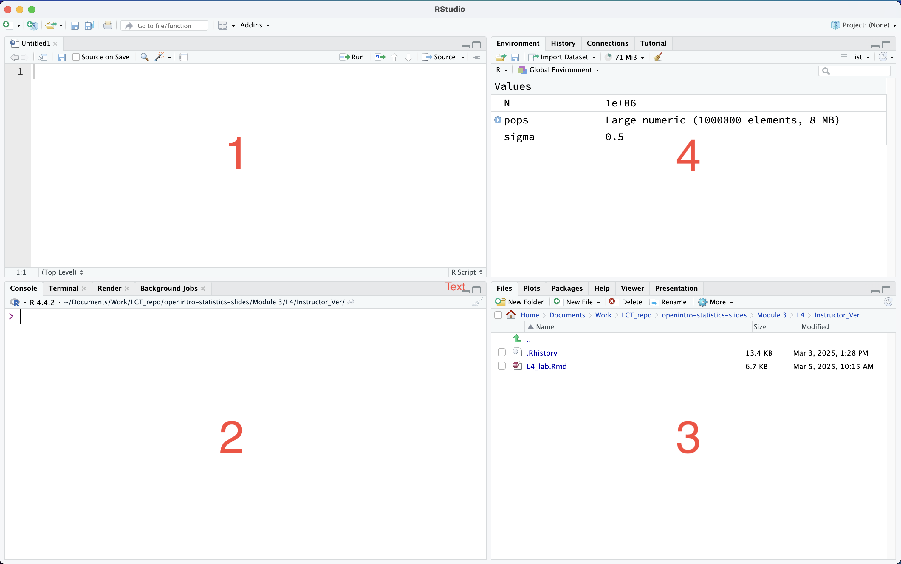
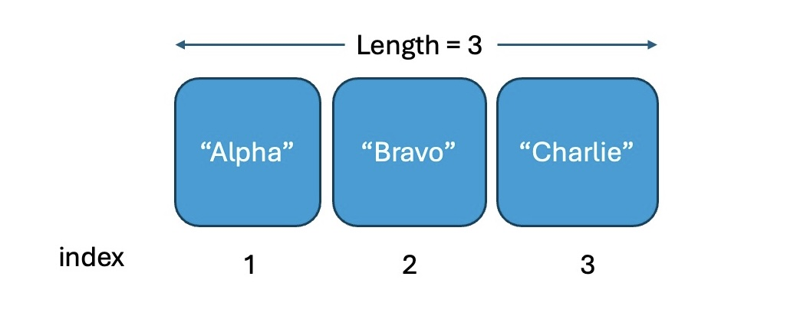
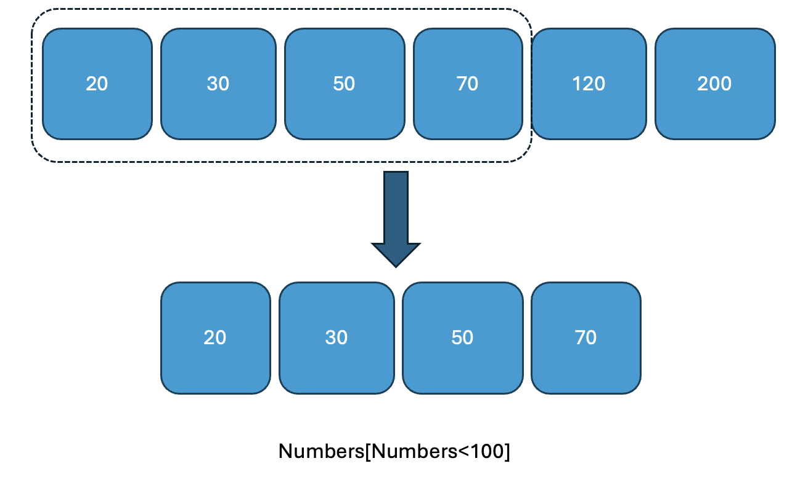

```{r setup, include=FALSE}
knitr::opts_chunk$set(echo = TRUE)
library(ggplot2)
library(dplyr)
```

## **Lab 1: Introduction to R**

In this lab session, we will learn basic syntax of R.

## Learning Objectives

-   Use R for Data Management and Exploration: Utilize R to load, pre-process, and explore data through visualization and summarization techniques.

#### Install R and RStudio.

You can download and install R from

<https://www.r-project.org/>

And you can download and install RStudio from

<https://posit.co/download/rstudio-desktop/>

We assume that you have already installed R and Rstudio (You need to install first R and then install Rstudio because Rstudio is an IDE for R).

## Introduction of R

-   R is Programming language and environment statistical computing, data manipulation and graphical display.

-   R is free and open source.

-   Rstudio is also free and open source IDE (Integrated Development Environment) for R.

## Brief walk through about RStudio interface

{width="767"}

window `1` : script window (text editor)

window `2` : console window (this is where you type your R code and run)

window `3` : plots, files, packages, help... window

window `4` : environment window

## Set up `working directory`

-   You can go to `Session` → `set working directory` → `choose directory` and then choose your working directory.

    or

-   You can go to `Files` tap → ☸︎ →'copy folder path to Clipboard'

    then paste into `setwd()` function

```{r, eval=FALSE, include=FALSE}

setwd('path of your working directory')

```

```{r, echo=TRUE, eval=FALSE, include=FALSE}

# for example
setwd('/Users/ylim2/Documents/Work/MA213') # this will set up your working directory
getwd() # to check where you are at in term of your working directory

```

or

-   You can go to `Files` tap → ☸︎ →'Set As Working Directory'

## How to run code?

1.  Directly type your command in the console window.

2.  You can run your R chunk by pressing run button `▶` in the R chunk in your R markdown file.

3.  You can write your commands on your R script file and highlight the commands and press `run`

```         
Run shortcut : `ctrl` + `enter` (windows) or `cmd` + `enter` (mac).
```

## R is basically a big calculator (some mathematics) : basic math operations to matrix operations

> -   Basic math operations
>
> `+`: add
>
> `-` : substract
>
> `*` : multiply
>
> `/` : divide
>
> `^` or `**`: exponent

## For example

$(\frac{12}{24})^2$

```{r, echo=TRUE}
(12/24)^(2)
#or
(12/24)**(2)

```

## Assign values to a variable

Let's say if you want to save 10 to variable `A`. You can do the following command.

```{r, echo=TRUE}
A <- 10
A <<- 10
10 -> A
10 ->> A
A = 10

# A <- 10
# A = 10 
# commonly used ones 
```

## And you can check what value the variable `A` has by calling it or using `print()` function

```{r, echo=TRUE}
A
print(A)
```

Assigning character type information to a variable

```{r, echo=TRUE}
SchoolName <- "Boston University"
SchoolName
```

## Assign values to a vector

You can assign multiple values to a vector.

```{r, echo=TRUE}
GPA <- c(3.2, 3.7, 3.9, 2.3, 2.7)
FirstName <- c("Tom", "Sarah", "Nick", "Amy", "John")
GPA
FirstName

```

There are some useful functions for a vector

-   `seq(from=a, to=b, by=c)` : this generates a sequence vector from value a to b by c increment.

-   `rep(x, times = n)` : this replicate element `x` for n times.

-   `length(x)` : this will give you the length of vector `x`

## Examples

```{r, echo=TRUE}
my_vector = seq(1, 10, 2)
my_vector

```

```{r, echo=TRUE}
another_vector = 1:10
another_vector

```

```{r, echo=TRUE}

vector3 = rep("BU", 25)
vector3

```

## Accessing vector elements

Each element in a vector is associated with index number. The index in R starts from 1 as the first item.

For example,

```{r, echo=TRUE}
#
SomeNames <- c("Alpha", "Bravo", "Charlie")


```



## For example

You can access the third element of `SomeNames` by `SomeNames[3]` .

You can also access, for example, the second and the third elements by `SomeNames[2:3]` .

```{r, echo=TRUE}
#
SomeNames[3]

SomeNames[2:3]


```

## Numeric vector can be subsetted using condition

``` {.R style="gray"}
                         x[condition]
```

the conditional statements (condition) you can use could be

``` {.R style="yellow"}
x == 20    # x equals to 20
x < 100
x <= 100
x > 100
x >= 100
x != 100   # x not equal to 100
```

## For example

```{r, echo=TRUE}
Numbers <- c(20, 30, 50, 70, 120, 200)
Numbers[Numbers<100]


```



## Importing and Subsetting Data

You can import Data by using `read.table()` function.

```{r, echo=TRUE}

my_data <- read.csv("mtcars.csv")
# to be able to import this file, this file needs to be in your working directory

```

## You can access subset data

-   Specific element by `my_data[row, column]`

    -   \| for example, the element in the third row and the fourth column `my_data[3,4]`

-   Specific row by `my_data[row,]`

    -   \| for example, all the element of the third row `my_data[3,]`

## Also,

-   Specific column by `my_data[,column]`

    -   \| for example, all the element of the fifth column `my_data[,5]`

-   Access the column by using `$` sign such as `my_data$column_name`

    -   \| for example, `hp` column from `my_data` is `my_data$hp`

-   Conditional statement works similar as vectors (row wise and column wise)

    -   \| for example, `my_data[my_data$hp<100,]`

## Multiple conditions can be combined

You can combine multiple logical conditions using & (AND), \| (OR), and ! (NOT) operators inside the row index to filter rows. For example

-   Rows where `hp` is less than 100 AND `cyl` equals 4:

```{r, echo=TRUE}

my_data[(my_data$hp < 100) & (my_data$cyl == 4), ]

```

-   Rows where `hp` is less than 100 OR `cyl` equals 4:

```{r, echo=TRUE}

my_data[my_data$hp < 100 | my_data$cyl == 4, ]

```

Rows where `hp` is NOT less than 100:

```{r, echo=TRUE}

my_data[! (my_data$hp < 100), ]

```

### If an expression or condition is True or False, programming language gives two answers `TRUE` or `FALSE` . It is sometimes can be shown to `1` or `0`. 

```{r, echo=TRUE}
3==3 # True
10 == 3 # False


```

```{r, echo=TRUE}
my_data$hp < 100 # if the horse power of the car is less than 100 it gives 1, 0 otherwise. 
my_data[my_data$hp < 100,] # this is how we are only printing the cars data with horse power < 100. 
```
