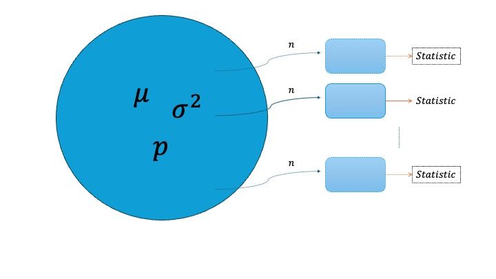
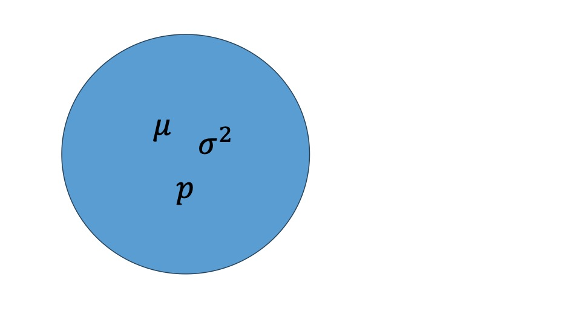
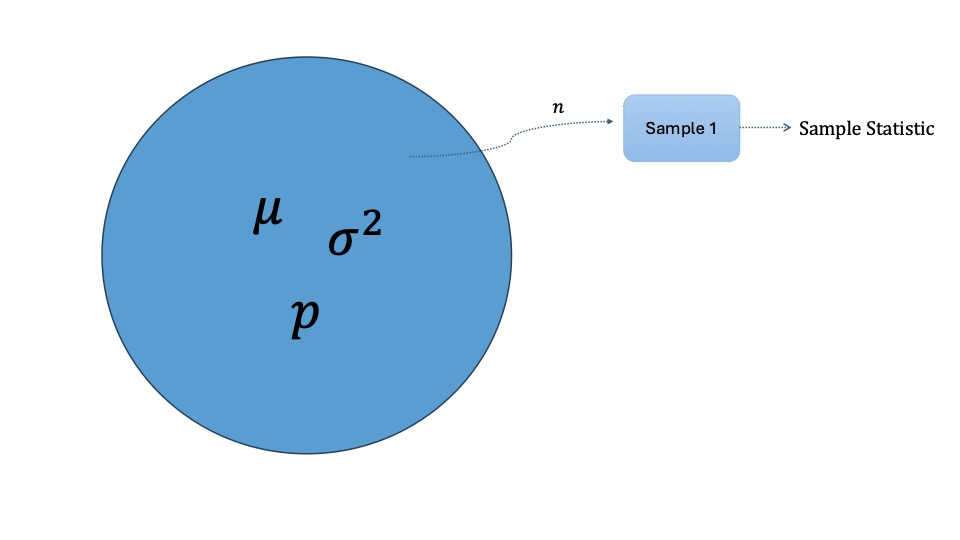
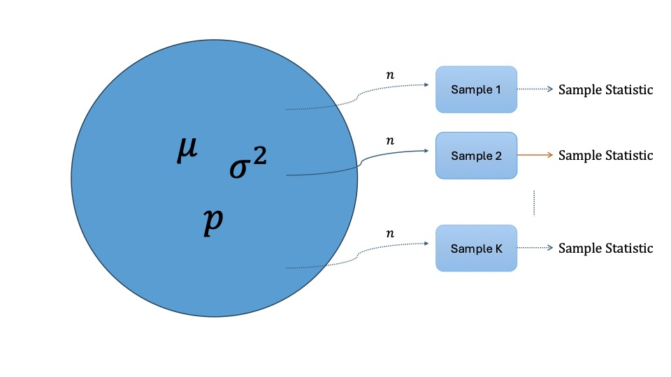

```{r setup, include=FALSE}
knitr::opts_chunk$set(echo = TRUE)
library(ggplot2)
library(dplyr)
```

# **Lab 5: Simulation and probability**

In this lab session, we will explore key concepts of inferential statistics which include sampling distribution and central limit theorem.

------------------------------------------------------------------------

#### Learning Objectives

-   Apply the Law of Large Numbers and Its Implications: Explain the Law of Large Numbers, why it holds, and its implications for predicting long-term averages in probability and statistics.

-   Model Data Using Bernoulli, Geometric, and Binomial Distributions: Recognize when to appropriately model data using the Bernoulli, geometric, and binomial distributions, and compute quantities of interest such as mean, standard deviation, and tail probabilities.

-   Assess Data Using the Normal Distribution: Use the normal distribution to assess the "unusualness" of data points, apply the 68-95-99.7% rule, evaluate normality through histograms and q-q plots, and determine when a normal approximation to the binomial model is valid for calculating binomial probabilities.

-   Understand Point Estimates and Sampling Variability: Define a sample statistic (point estimate) for a population parameter, and explain how it varies across different samples.

-   Visualize and Interpret Sampling Distributions: Draw and interpret sampling distributions for a point estimate (e.g., population proportion) across different sample sizes, explaining how the distribution changes as the sample size increases.

-   Calculate and Interpret Standard Error: Calculate the standard error for proportions and interpret it as a measure of sampling variability.

------------------------------------------------------------------------

-   The role of sampling distribution : Why do we care about sampling distribution?

    1.  What is sampling distribution?

    -\> In inferential statistics, we estimate the characteristics of the population parameter by using characteristics of sample (statistic).

    -\> The distribution of the statistic obtained from sample is called sampling distribution.

{width="100%"}

Here are steps for the simulation study.

## Step 0 : Create a hypothetical population



## Step 1 : [Sample `n` samples from the population]{.underline} and [get the sample statistic from the sample]{.underline}



## Step 2 : Repeat Step 1 `K` times to obtain `K` many sample statistics



## Example

We have a hypothetical population that are

``` r
pop <- c(rep("Apple", 10000), rep("Android", 4000))
```

So that the true proportion of having apple device is $p=\frac{10000}{14000} = 0.7142$.

Let's sample them with $n=500$. What does the sampling distribution look like?

1.  Let's take a sample from the population `pop` and assign it to an object called `p_hat`.

    (Hint: Use the `sample()` function. Also, count how many apples are in the sample.)

```{r}
# Step 0
pop <- c(rep("Apple", 10000), rep("Android", 4000)) # population
true_proportion <- sum(pop == "Apple") / 14000
true_proportion  # population proportion p

# Step 1 
n = 1000 # sample size
my_sample <- sample(pop, n)
glimpse(my_sample) # your sample
p_hat <- sum(my_sample == "Apple") / n
p_hat
```

2.  What is the sampling distribution looks like? To answer this question we need `K` many sample statistics. In other words, we need to repeat steps 1 and 2 $K$ times.

(hint : Use `for loop` )

```{r, eval=False}
# Step 2

K = 500
p_hat_vector <-rep(0,K)

#
# for loop
#

p_hat_vector


```

3.  Using `p_hat_vector` , show the shape of sampling distribution.

```{r, echo=FALSE, include=FALSE}
p_hat_vector = read.csv("p_hat_vector.csv")
p_hat_vector = p_hat_vector$x
```

```{r}

sample_data <- data.frame(p_hat = p_hat_vector) #p_hat is the name of the column

# Histogram of p_hat
ggplot(data=sample_data, aes(x=p_hat)) + geom_histogram(bins=20)


```

## Empirical Rule to check Normality

Can we also check whether $\hat{p}$ follows normal distribution in a different way?

We can check it through 68-95-99.7 rule.

```{r}
# get the sample mean and standard deviation of the sampled proportions

p_hat_data <- data.frame(p_hat = p_hat_vector)

# mean
p_hat_mean = mean(p_hat_data$p_hat)

# standard deviation
p_hat_sd = sd(p_hat_data$p_hat)
p_hat_sd


```

Is within 1 standard deviation data approximately 68% ?

```{r}


# let's check 68-95-99.7 rule

df <- p_hat_data$p_hat

# within 1 standard deviation 
range <-  (df > (p_hat_mean - 1 * p_hat_sd)) & (df < (p_hat_mean + 1 * p_hat_sd))

df_temp <- df[ range ]

rate <- length(df_temp) / length(df)
rate


```

How close is this rate to 68% ? Is the difference in the rate less than 0.05?

```{r}


abs(rate - 0.68) < 0.05 # abs function gives absolute value


```
